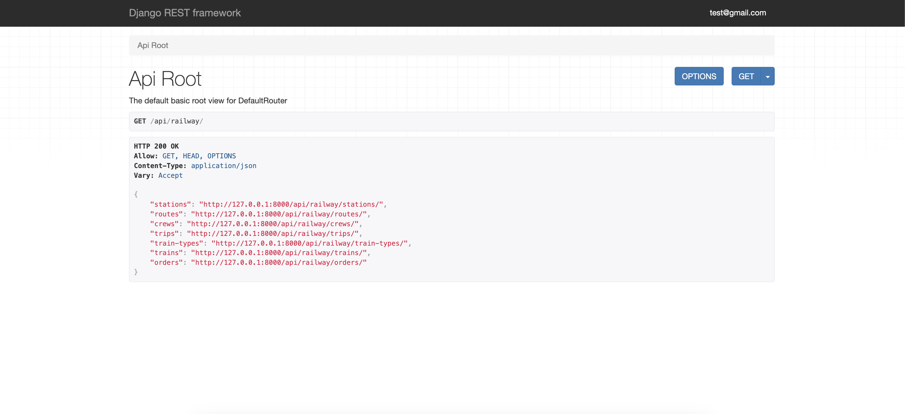

# Modern-Railway

Modern-Railway project for managing trains, routes, stations, trips and crews. The project runs inside Docker with
PostgreSQL as the database.

## Installing using GitHub

Install PostgreSQL and create db

```bash
git clone https://github.com/VPiliaiev/modern-railway.git
cd railway
python -m venv venv
source venv/bin/activate
pip install -r requirements.txt

set POSTGRES_DB=<your_db_name>
set POSTGRES_USER=<your_db_user>
set POSTGRES_PASSWORD=<your_db_password>
set POSTGRES_HOST=<your_db_host>
set POSTGRES_PORT=<your_db_port>

python manage.py makemigrations
python manage.py migrate

python manage.py createsuperuser
python manage.py runserver
```

## Run with Docker

Docker should be installed.

```bash
docker-compose build

docker-compose up
```

## Getting Access

Create user via "/api/user/register/".

Get access token "/api/user/token/".

## Test User

Email: test@gmail.com

Password: testpass

## Features

- JWT-authenticated API
- Admin panel accessible at `/admin/`
- Swagger API documentation available at `/api/doc/swagger/`
- Manage orders and tickets
- Create and manage trips
- Filter trips by source, destination, and departure date
- Upload and manage train images
- Automatic seat availability calculation per trip
- CRUD operations for trains, crews, and train types
- PostgreSQL database integration 
- Dockerized application 


